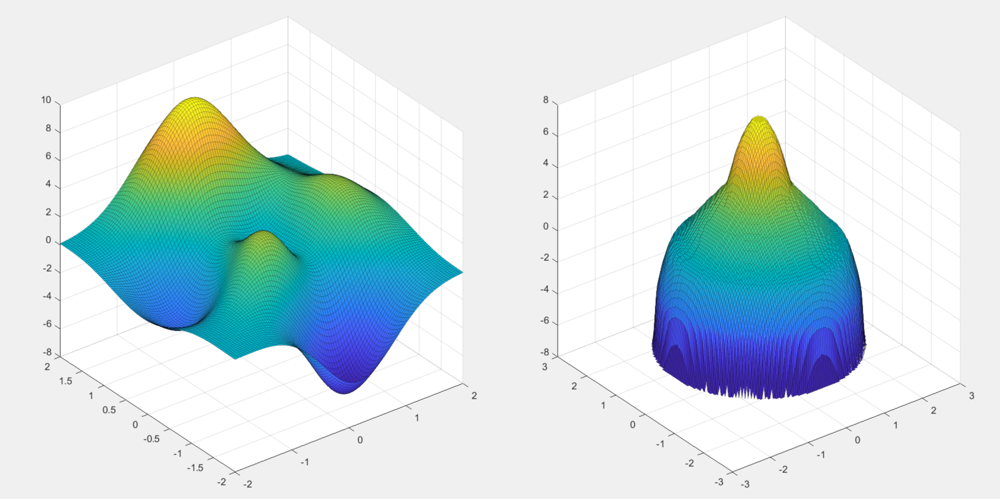
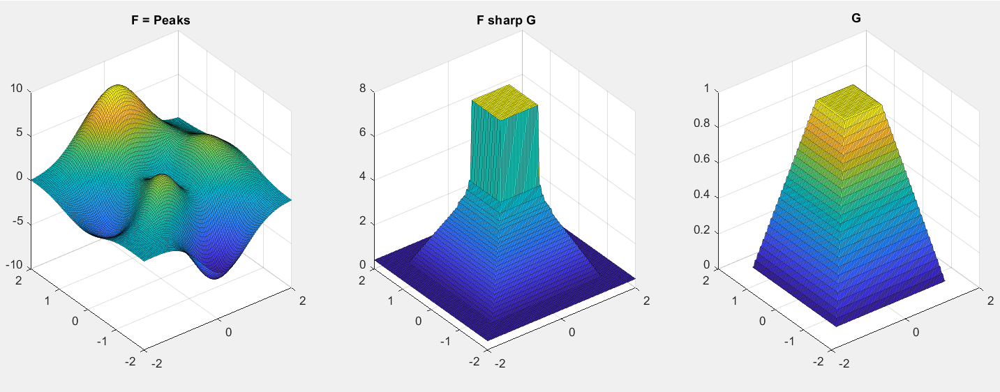

This is a repository containing tools to rearrange two-variables functions in MATLAB. 

# Installation
Add the folder "Code" to your MATLAB path and you are ready to go!

# Usage
Fucntions are stored as `contourLines` objects. This is a class that contains all the needed informations to rearrange.
## Constructor
Given a two-variables function `F`, you want to pass it to the constructor as a function handle.
``` 
function z = F(x,y)
	z=x+y;
end
Fsharp = contourLines(@F);
```
The line `Fsharp = contourLines(@F);` will create a *contourLines* object named Fsharp, which stores 100 levels of the function F .  The complete constructor method can be called as follows.
```
Fsharp = contourLines(@F, gridCoordinates,numberOfCells,numberOfLevels);
```
When specified, the variables should be of the following form:
- `gridCoordinates=[xmin xmax ymin ymax]` is describing the square domain in which the function is restricted to; **default** `[-1 1 -1 1]`; 
- `numberOfCells` determines how many points are constructed in the grid; **default** `20` will give a 20x20 grid;
- `numberOfLevels` determines how many levels of the function are stored; **default** `100`
### Different bounded domains
If you want to construct a function with a domain E different from a rectangle, you can pass to the constructor method a function `F` which is `-inf` outside of E.
## Schwarz rearrangement
Given a function F and the contourLines object `Fsharp` relative to it, you can call the Schwarz (spherically decreasing) rearrangement of F as the function
```
Fsharp.Schwarz(x,y);
```
with $x$ and $y$ real numbers. If the couple $(x,y)$ is outside of the ball where the Schwarz rearrangement is defined, a `NaN` will be given as an output.
## Rearrangement along another function
An example is given in the file `Rearrangement2.m`.




Given two functions `F`, `G` and the respective contourLines objects `Fsharp` and `Gsharp`,  you can call the rearrangement of F along G as the function
```
Fsharp.Schwarz(x,y,Gsharp);
```
with x and y real numbers. If the couple (x,y) is outside of the set where the Schwarz rearrangement is defined (i.e. the biggest superlevel set of G inside the initial grid), a `NaN` will be given as an output.
## Plot Level
Given a contourLines object `Fsharp`, you can plot the `i`-th level of `Fsharp` with the line
```
Fsharp.plotLevel(i)
```
The number `i` can go from 1 to `Fsharp.numberOfLevels`. Bigger the `i`, smaller the level set.
## Distribution function
 The distribution function of $F$ is the function
```math
\mu_F(t)=\lvert \set{f>t}\rvert. 
```
A distribution function is stored inside the class contourLines. If Fsharp is a contourLines object, you can call its distribution function by
```
Fsharp.distributionFunction(t);
```
where `t` is a real number.
## Radially decreasing rearrangement
The radially decreasing rearrangement of $F$ is defined as
```math
	F^*(m)=\inf \Set{t\in\mathbb{R} | \mu_F(t)\le m}.
```
The radially decreasing rearrangement function is stored in the contourLines object, and you can call it by
```
Fsharp.radDecrRearr(m);
```
where `m` is a real number.
